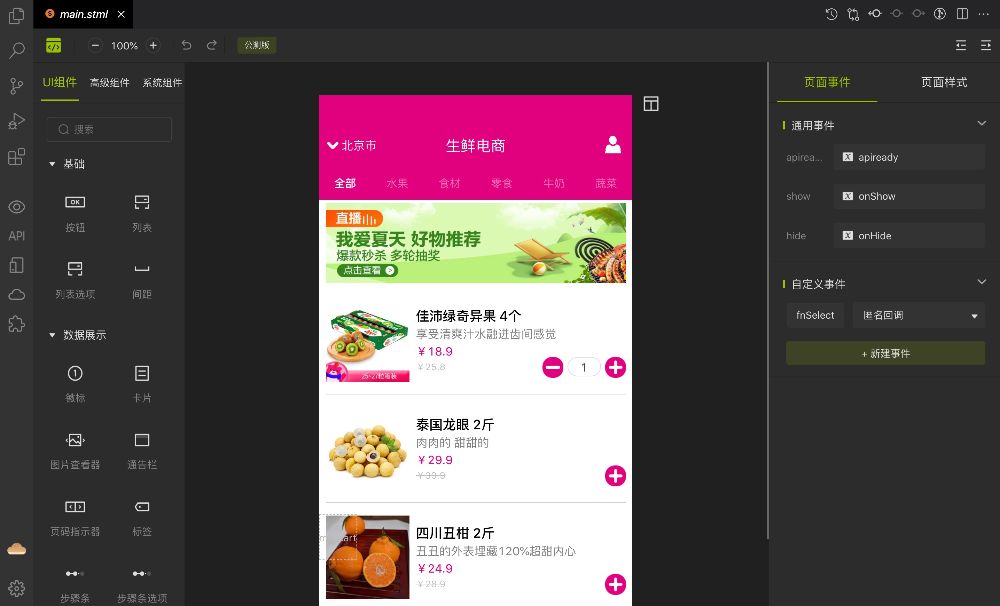
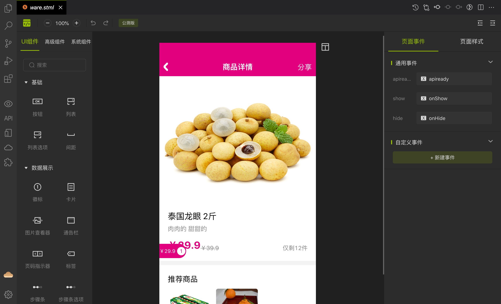
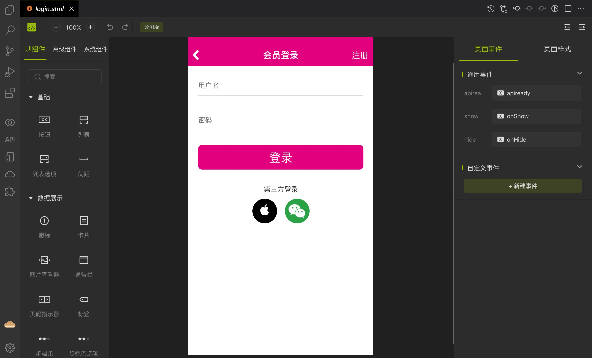
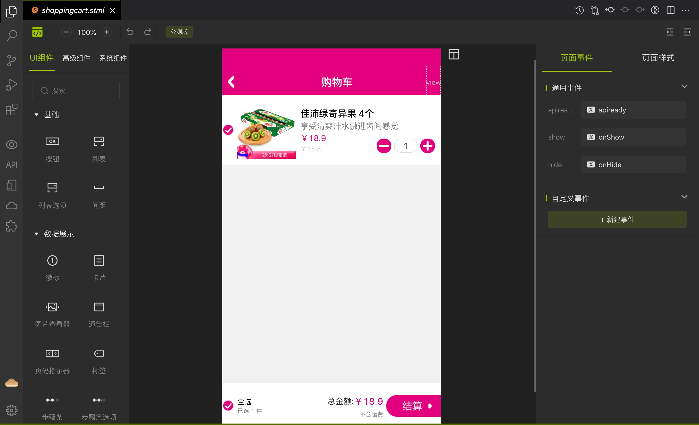
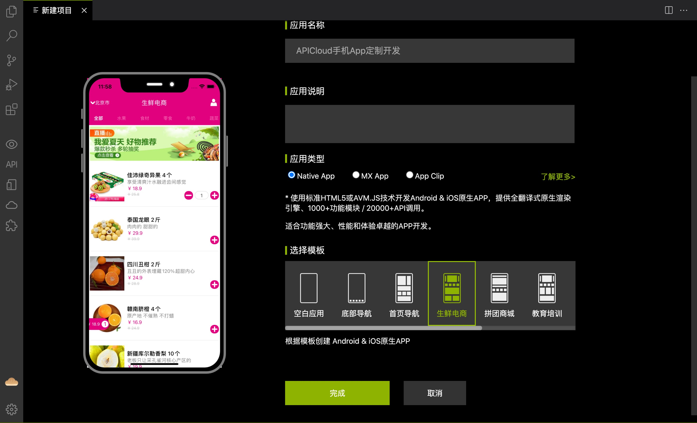
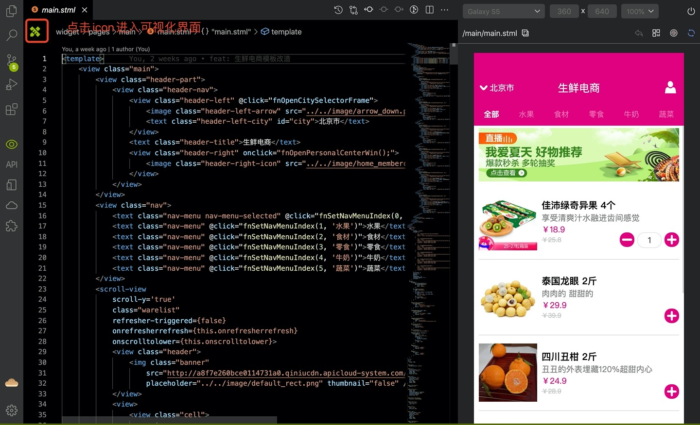
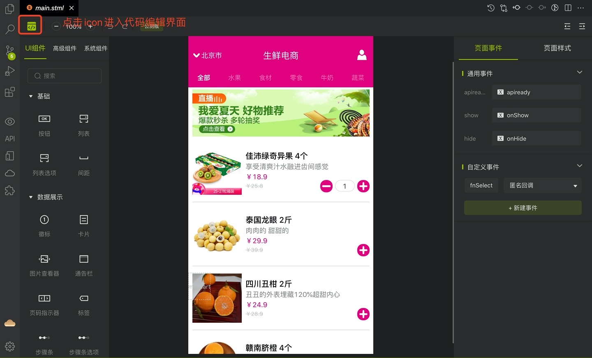

# 项目介绍
## 功能描述

该模板为生鲜电商APP应用模板，主要功能包括商品列表展示、商品详情查看、购物车、个人中心、基础设置等。通过此模板的使用能快速上手avm多端开发技术，并能在此模板基础上使用可视化工具快速开发出一套完整的生鲜电商类应用。里面涉及到的所有页面用到的数据都是静态数据。目的是为了实现在APICloud可视化工具设计界面中能够正常显示页面中的内容。

## 可视化界面显示效果截图






## 源码文件目录结构说明

项目源码在widget目录下，该目录下的文件说明如下：
```
┌─component/ // 项目公共组件目录 
├─images/ // 图片素材图标资源目录 
├─pages/ // AVM页面目录 
│ ├─about/ 
│ │ └─about.stml // 关于我们页 
│ ├─account/ 
│ │ └─account.stml // 我的账户页 
│ ├─address/ 
│ │ └─address.stml // 收货地址页 
│ ├─balancehelp/ 
│ │ └─balancehelp.stml // 余额帮助页 
│ ├─billhistory/ 
│ │ └─billhistory.stml // 付款记录页 
│ ├─cityselector/ 
│ │ └─cityselector.stml // 城市选择页 
│ ├─coupon/ 
│ │ └─coupon.stml // 我的优惠券页 
│ ├─customerservice/ 
│ │ └─customerservice.stml // 客服服务页 
│ ├─login/ 
│ │ └─login.stml // 登录页 
│ ├─main/ 
│ │ └─main.stml // 主页 
│ ├─message/ 
│ │ └─message.stml // 消息页 
│ ├─myorder/ 
│ │ └─myorder.stml // 我的订单页 
│ ├─order/ 
│ │ └─order.stml // 确认订单列表页 
│ ├─personalcenter/ 
│ │ └─personalcenter.stml // 个人中心主页 
│ ├─register/ 
│ │ └─register.stml // 注册页 
│ ├─setaddress/ 
│ │ └─setaddress.stml // 收货地址设置页 
│ ├─setting/ 
│ │ └─setting.stml // 设置页 
│ ├─share_frame/ 
│ │ └─share_frame.stml // 分享页 
│ ├─shoppingcart/ 
│ │ └─shoppingcart.stml // 购物车 
├─script/ // JavaScript脚本目录 
└─config.xml // 应用配置文件
```

## 怎么使用可视化工具进行开发

+ 下载最新版的[APICloud Studio 3](https://www.apicloud.com/studio3#downloadBtn)

+ 下载成功后，安装后打开，顶部菜单选择【项目】-【新建项目】，填写应用名称，选择相应模板，点【完成】按钮进行创建。



+ 创建完项目后打开某一个页面，点击左上角图标可切换为可视化界面，可进行页面的设计，左侧栏可根据项目需求拖拽任意组件到画布中，右侧属性设置栏可对拖拽的组件进行设置。具体操作可查看 [可视化工具的使用视频](https://www.apicloud.com/video_play/20_1825)。




## 技术支持

使用中若有任何疑问可到APICloud论坛 [AVM多端](https://developer.yonyou.com/forum-71-1.html) 专区发帖提问。官方技术支持和众多活跃开发者会第一时间为您提供技术支持。


## 项目源码地址

http://git.yonyou.com/APICloud-CF/fresh-ec_lc